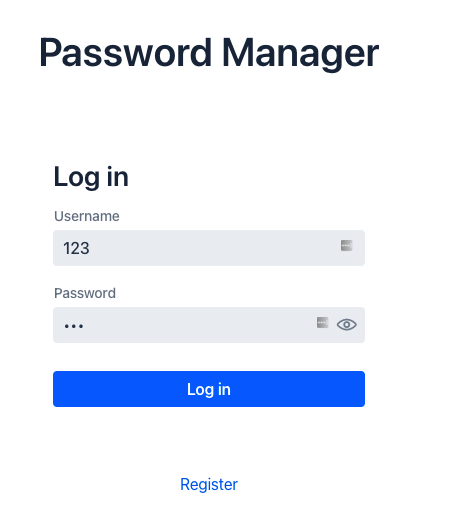

# Password Manager

This Application stores and manages users usernames and password information of the
different accounts. This application will help the user remember different usernames and
passwords for accounts on the internet in the secure encrypted database.Furthermore,
users allow adding, edit, and delete accounts details using this tool.
The encrypted Password Manager tool saves all the details will be saved in the
database in encrypted format.

## Running the application

The project is a standard Spring boot project with [vaadin](https://vaadin.com/) framework for front-end.After running the application, open http://localhost:8080 in your browser.
This project requires Node.js and npm to be installed on your computer to build front-end assets.

##**How to run this project:**
>The main root of the project is src/main/java. 
> Once you run the Applicatio class inside the src/main/java/com/passwordmanager, the project will be compiled and run as spring boot project 
> all the dependencies are installed in the node_modules folder.
>
> Test cases available inside src/test folder.

### Login window
To run this application, open http://localhost:8080 in your browser and user will first see the login window; then, they can type their username and master password to log in or register as a new user. Example  of Log in window given below.
During project build-up, the application will create a new user with username "**user**" and password "**pass**".

###Register window

 Register as a  new user with a username and password.

###Main window
After logging in, you will reach the main window where all the passwords are stored. 

### Add Password 
When you want to add a new password, Click on the `Add Password` button, and the right side layout is shown. After adding a new password is finished, the list will be updated. Click on the `Delete` button to delete the password item, and to log out, click on the `Logout` button.

